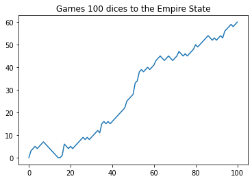
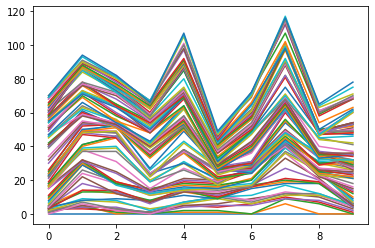
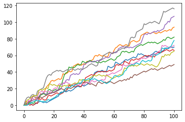
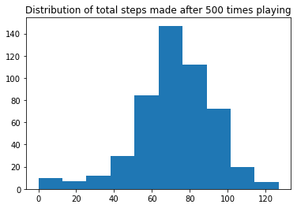

You are playing a game using a dice to make steps to the Empire Tower.
The Empire Tower is 60 steps height. 
You will throw a dice 100 times to make "A Random Walk".
If the dice =
. 1,2 : -1 step
. 3,4,5: + 1 step
. 6 : throw again
After 100 times of throwing how far can you be?


```python
# Simulate 'A Random walk' (100 times throwing the dices)
```


```python
import numpy as np
np.random.seed(123)
random_walk = [0]       #initialize random_walk

for x in range(100) :
    step = random_walk[-1]
    dice = np.random.randint(1, 7)
    if dice <= 2 :
        step = max(0, step - 1) #step >= 0
    elif dice <= 5 :
        step = step + 1
    else:
        step = step + np.random.randint(1, 7)
    random_walk.append(step)

print(random_walk)

import matplotlib.pyplot as plt
plt.plot(random_walk)
plt.title('Games 100 dices to the Empire State')
plt.show()
```

    [0, 3, 4, 5, 4, 5, 6, 7, 6, 5, 4, 3, 2, 1, 0, 0, 1, 6, 5, 4, 5, 4, 5, 6, 7, 8, 9, 8, 9, 8, 9, 10, 11, 12, 11, 15, 16, 15, 16, 15, 16, 17, 18, 19, 20, 21, 22, 25, 26, 27, 28, 33, 34, 38, 39, 38, 39, 40, 39, 40, 41, 43, 44, 45, 44, 43, 44, 45, 44, 43, 44, 45, 47, 46, 45, 46, 45, 46, 47, 48, 50, 49, 50, 51, 52, 53, 54, 53, 52, 53, 52, 53, 54, 53, 56, 57, 58, 59, 58, 59, 60]
    


    

    


```python
# Simulate 'A random walk' for 10 times.Plot the result
```


```python
import numpy as np
import matplotlib.pyplot as plt

np.random.seed(123)
all_walks = []
for x in range(10) :
    random_walk = [0]       #initialize random_walk
    for x in range(100) :
        step = random_walk[-1]
        dice = np.random.randint(1, 7)
        if dice <= 2 :
            step = max(0, step - 1)
        elif dice <= 5 :
            step = step + 1
        else:
            step = step + np.random.randint(1, 7)
        if np.random.rand() <= 0.001 :
            step = 0
            
        random_walk.append(step)
    all_walks.append(random_walk)
ar_aw = np.array(all_walks)   # Convert lists to Numpy array
plt.plot(ar_aw)
plt.show()
plt.clf()

tr_ar_aw = np.transpose(ar_aw)   #Reverse or permute the axes of an array; returns the modified array
plt.plot(tr_ar_aw)
plt.show()
```


    

    


    

    


```python
# You are clumsy and you have 0.1% of falling down and the step turns back to 0. 
# What are the odds that you'll reach 60 steps height if you throw 500 times?
```


```python
import numpy as np
import matplotlib.pyplot as plt

np.random.seed(123)
all_walks = []
for x in range(500):
    random_walk = [0]
    for x in range(100):        
        step = random_walk[-1]
        dice = np.random.randint(1,7)
        if dice <= 2:
            step = max(0,step - 1)
        elif dice <= 5:
            step = step + 1
        else :
            step = step + np.random.randint(1,7)
        if np.random.rand() <= 0.001 :
            step = 0
        random_walk.append(step)
    all_walks.append(random_walk[-1])
    
print(all_walks)
plt.hist(all_walks)
plt.title('Distribution of total steps made after 500 times playing')
plt.show()
    
```

    [0, 1, 0, 1, 3, 4, 5, 4, 5, 4, 5, 4, 5, 7, 8, 7, 8, 7, 6, 7, 8, 7, 6, 7, 9, 10, 11, 12, 13, 12, 13, 14, 15, 19, 20, 22, 23, 24, 28, 27, 26, 27, 28, 27, 28, 27, 26, 29, 30, 31, 32, 33, 34, 35, 36, 35, 36, 37, 38, 39, 38, 40, 39, 40, 39, 40, 39, 40, 41, 40, 41, 42, 43, 44, 45, 44, 45, 47, 46, 45, 46, 45, 44, 45, 46, 47, 52, 51, 56, 57, 56, 57, 58, 59, 60, 59, 58, 59, 60, 61, 65]
    [70, 94, 82, 66, 107, 49, 72, 116, 65, 78, 87, 47, 81, 75, 56, 70, 77, 88, 55, 42, 74, 64, 63, 58, 70, 55, 93, 98, 58, 60, 70, 70, 72, 71, 47, 78, 78, 79, 71, 83, 71, 56, 63, 94, 49, 72, 63, 74, 61, 61, 79, 91, 46, 66, 70, 55, 0, 80, 45, 89, 91, 61, 83, 71, 60, 68, 74, 85, 68, 88, 64, 84, 114, 61, 65, 78, 63, 61, 90, 96, 83, 77, 80, 71, 87, 73, 60, 85, 84, 76, 105, 57, 98, 46, 63, 112, 81, 45, 101, 74, 77, 13, 81, 47, 97, 90, 66, 52, 63, 54, 91, 26, 101, 81, 64, 95, 83, 99, 75, 75, 61, 97, 57, 94, 76, 82, 86, 52, 122, 110, 91, 47, 34, 94, 106, 58, 74, 75, 93, 64, 57, 76, 100, 66, 98, 94, 60, 72, 55, 85, 66, 69, 59, 78, 81, 87, 75, 58, 80, 97, 75, 67, 22, 6, 78, 87, 87, 80, 80, 108, 59, 83, 76, 60, 73, 75, 8, 116, 10, 106, 78, 76, 53, 103, 42, 49, 101, 80, 73, 66, 93, 92, 63, 89, 59, 50, 57, 72, 41, 94, 79, 63, 88, 109, 88, 95, 52, 74, 70, 80, 89, 77, 42, 83, 72, 65, 87, 80, 59, 67, 65, 70, 86, 104, 69, 76, 76, 13, 39, 64, 57, 102, 66, 71, 73, 2, 83, 75, 71, 84, 66, 79, 73, 56, 76, 84, 54, 73, 57, 99, 69, 83, 33, 86, 81, 55, 77, 100, 87, 52, 75, 58, 80, 98, 64, 75, 77, 58, 62, 98, 57, 89, 7, 49, 66, 88, 108, 71, 32, 56, 54, 116, 87, 63, 88, 77, 107, 67, 67, 71, 78, 64, 108, 24, 93, 100, 65, 97, 74, 70, 79, 59, 66, 82, 87, 71, 43, 86, 68, 80, 50, 61, 67, 43, 59, 31, 31, 69, 60, 110, 57, 95, 63, 56, 117, 72, 71, 99, 72, 81, 69, 2, 28, 103, 89, 63, 61, 54, 78, 65, 64, 84, 31, 85, 69, 65, 77, 38, 70, 89, 58, 78, 43, 69, 69, 14, 81, 107, 70, 52, 55, 41, 83, 90, 94, 63, 46, 101, 82, 76, 84, 91, 79, 83, 94, 73, 71, 67, 95, 68, 97, 95, 12, 72, 75, 78, 93, 87, 71, 10, 74, 22, 70, 48, 92, 81, 90, 73, 66, 97, 76, 64, 100, 76, 58, 94, 80, 63, 71, 41, 86, 81, 95, 64, 69, 25, 69, 87, 64, 93, 82, 89, 51, 68, 5, 82, 75, 74, 82, 101, 75, 49, 60, 89, 61, 68, 32, 72, 54, 70, 51, 46, 40, 77, 83, 81, 85, 91, 73, 52, 80, 70, 38, 127, 60, 110, 77, 56, 82, 88, 98, 86, 67, 66, 60, 72, 92, 75, 109, 61, 78, 77, 98, 62, 67, 68, 69, 46, 65, 96, 67, 91, 95, 71, 86, 84, 73, 73, 67, 62, 38, 69, 76, 78, 88, 80, 80, 91, 57, 65]
    


    

    


```python
import numpy as np
import matplotlib.pyplot as plt

np.random.seed(123)
all_walks = []
for x in range(500):
    random_walk = [0]
    for x in range(100):        
        step = random_walk[-1]
        dice = np.random.randint(1,7)
        if dice <= 2:
            step = max(0,step - 1)
        elif dice <= 5:
            step = step + 1
        else :
            step = step + np.random.randint(1,7)
        if np.random.rand() <= 0.001 :
            step = 0
        random_walk.append(step)
    all_walks.append(random_walk)
    
tr_ar_aw = np.transpose(np.array(all_walks))
ends = tr_ar_aw[-1,:]
print(ends)
percent_win = np.mean(ends >= 60)
print(percent_win)

plt.hist(ends)
plt.title('Distribution of total steps made after 500 times playing')
plt.show()
```

    [ 70  94  82  66 107  49  72 116  65  78  87  47  81  75  56  70  77  88
      55  42  74  64  63  58  70  55  93  98  58  60  70  70  72  71  47  78
      78  79  71  83  71  56  63  94  49  72  63  74  61  61  79  91  46  66
      70  55   0  80  45  89  91  61  83  71  60  68  74  85  68  88  64  84
     114  61  65  78  63  61  90  96  83  77  80  71  87  73  60  85  84  76
     105  57  98  46  63 112  81  45 101  74  77  13  81  47  97  90  66  52
      63  54  91  26 101  81  64  95  83  99  75  75  61  97  57  94  76  82
      86  52 122 110  91  47  34  94 106  58  74  75  93  64  57  76 100  66
      98  94  60  72  55  85  66  69  59  78  81  87  75  58  80  97  75  67
      22   6  78  87  87  80  80 108  59  83  76  60  73  75   8 116  10 106
      78  76  53 103  42  49 101  80  73  66  93  92  63  89  59  50  57  72
      41  94  79  63  88 109  88  95  52  74  70  80  89  77  42  83  72  65
      87  80  59  67  65  70  86 104  69  76  76  13  39  64  57 102  66  71
      73   2  83  75  71  84  66  79  73  56  76  84  54  73  57  99  69  83
      33  86  81  55  77 100  87  52  75  58  80  98  64  75  77  58  62  98
      57  89   7  49  66  88 108  71  32  56  54 116  87  63  88  77 107  67
      67  71  78  64 108  24  93 100  65  97  74  70  79  59  66  82  87  71
      43  86  68  80  50  61  67  43  59  31  31  69  60 110  57  95  63  56
     117  72  71  99  72  81  69   2  28 103  89  63  61  54  78  65  64  84
      31  85  69  65  77  38  70  89  58  78  43  69  69  14  81 107  70  52
      55  41  83  90  94  63  46 101  82  76  84  91  79  83  94  73  71  67
      95  68  97  95  12  72  75  78  93  87  71  10  74  22  70  48  92  81
      90  73  66  97  76  64 100  76  58  94  80  63  71  41  86  81  95  64
      69  25  69  87  64  93  82  89  51  68   5  82  75  74  82 101  75  49
      60  89  61  68  32  72  54  70  51  46  40  77  83  81  85  91  73  52
      80  70  38 127  60 110  77  56  82  88  98  86  67  66  60  72  92  75
     109  61  78  77  98  62  67  68  69  46  65  96  67  91  95  71  86  84
      73  73  67  62  38  69  76  78  88  80  80  91  57  65]
    0.784
    


    

    

